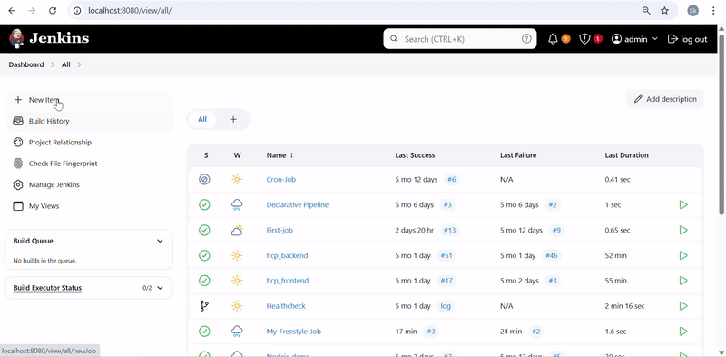

# 🧪 Jenkins Freestyle Job: Role-Based Dynamic Shell Execution



### A parameterized Jenkins job that echoes a user's name and designation and executes role-specific messages using a Shell build step.

---

## 📝 Overview

This Freestyle Jenkins job:

- Accepts a `Username` as a **String Parameter**
- Accepts a `Designation` from a list of predefined **Choices**
- Executes a **Shell script** based on user input
- Prints a custom message based on the selected designation

---

## 🎛️ Step-by-Step Job Configuration

### 1. 🧱 Create a Freestyle Job

- Navigate to **Jenkins Dashboard**
- Click **New Item**
- Enter a job name: `My-FreeStyle-Job`
- Choose **Freestyle project**
- Click **OK**

---

### 2. 🔧 Enable Parameters

Check ✅ **This project is parameterized**

#### 🔹 String Parameter

| Field       | Value              |
|-------------|--------------------|
| Name        | `Username`         |
| Description | Enter your name    |

#### 🔹 Choice Parameter

| Field       | Value                       |
|-------------|-----------------------------|
| Name        | `Designation`               |
| Choices     | (one per line)              |
|             | Senior Software Engineer    |
|             | Data Scientist              |
|             | App Developer               |
| Description | Select your designation     |

---

### 3. 💻 Add a Shell Build Step

Click **Add build step** → **Execute Shell**

Paste the following shell script:

```bash
echo "Hello world!"
echo "My Name is $Username"
echo "I am a $Designation"

# Optional logic
case "$Designation" in
  "Senior Software Engineer")
    echo "I build software"
    ;;
  "Data Scientist")
    echo "I build Machine Learning Algorithms"
    ;;
  "App Developer")
    echo "I build Apps for Android and iOS"
    ;;
  *)
    echo "Unknown designation"
    ;;
esac
```
▶️ Running the Job
Click Build with Parameters

Enter values:

Username: Alice

Designation: Data Scientist

Click Build

View output in Console Output

🖥️ Sample Console Output
```
Hello world!
My Name is Alice
I am a Data Scientist
I build Machine Learning Algorithms
```
